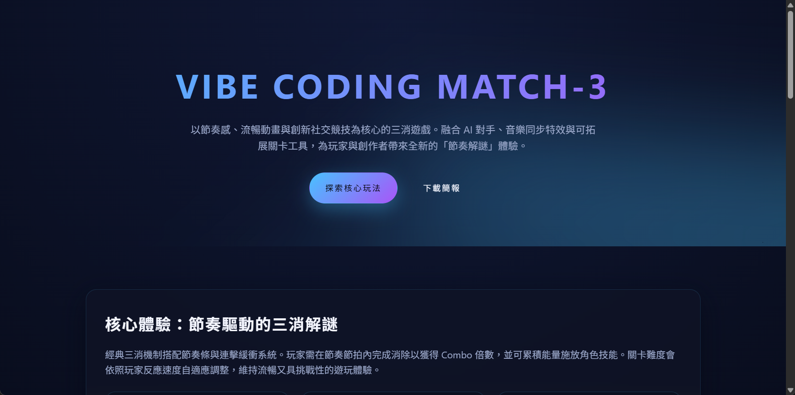

# VibeCodingMatch-3Game
Vibe Coding Match-3 Game - 在 index.html:1 新建單頁式介紹，採未來科技霓虹視覺，涵蓋核心玩法、世界觀、商業模式、亮點與開發里程碑，CTA 連結錨點已配置。

# Documentation
- 於 openspec/project.md:1 填寫專案目的、技術堆疊、程式風格、測試與 Git 流程、領域背景與限制，建立後續作業共識。
- 在 AGENTS.md:1 保留 OpenSpec 區塊並新增具體代理指引、工作流程與交付檢查清單，確保未來協作遵循相同準則。

建議接下來以瀏覽器開啟 index.html 檢視桌機與手機排版，必要時再調整資產或互動效果。
